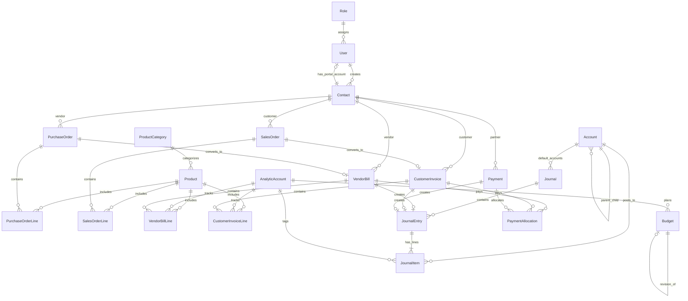

# Implementation Plan: Urban Furniture Accounting System

A production-grade, double-entry accounting web application for **Urban Furniture**, built with React + Vite + Tailwind CSS frontend, Express + TypeScript + Prisma ORM + MySQL 8 backend, real double-entry ledger bookkeeping, OCR extraction assistant, role-based access control, interactive budgeting with revisions, and comprehensive financial reports.

---

## User Review Required

> [!IMPORTANT]
> **Key Architectural & Accounting Decisions**:
> 1. **Database & Infrastructure**: Local MySQL 8.0 on `localhost:3306`, database `urban_furniture_db`, user `root`, password `1234`.
> 2. **Double-Entry Enforcement**: Multi-step operations (e.g., Post Bill $\rightarrow$ Create Journal Entry $\rightarrow$ Journal Items $\rightarrow$ Ledger update) run inside Prisma interactive atomic transactions (`prisma.$transaction`). An entry is posted only when $\sum \text{Debit} == \sum \text{Credit}$.
> 3. **Monetary Precision**: All monetary values are handled as `Prisma.Decimal` / MySQL `DECIMAL(15,2)` in the backend and formatted in INR (₹) without floating-point drift.
> 4. **Contact User Auto-Creation**: As requested in PRD & Excalidraw, when a Contact with a valid email is created, a corresponding portal user with `CONTACT_USER` role is provisioned so they can log into their self-service invoice/bill portal.
> 5. **Budget State & Revision Workflow**: Supports `DRAFT` $\rightarrow$ `CONFIRMED` $\rightarrow$ `REVISED` / `CANCELLED`. When a confirmed budget is revised, a new budget is generated with suffix `"Revised"`, linking bidirectionally to the original.
> 6. **OCR Assistant**: Pluggable OCR service supporting file upload (PDF/Images) with preview, heuristic/pattern extraction for vendor, invoice #, dates, lines, and totals, presenting an editable side-by-side review modal that drafts (never auto-posts) the bill/invoice.

---

## Complete Pre-Coding Analysis

### A. Complete Requirement Summary

#### 1. Business Objective
Urban Furniture requires an end-to-end accounting enterprise application that manages its complete financial lifecycle:
- Master data definition (Contacts, Products, Chart of Accounts, Journals, Analytic Accounts, Budgets).
- Purchase workflow: Purchase Order (PO) $\rightarrow$ Vendor Bill $\rightarrow$ Payment $\rightarrow$ Journal Entry $\rightarrow$ Ledger.
- Sales workflow: Sales Order (SO) $\rightarrow$ Customer Invoice $\rightarrow$ Payment $\rightarrow$ Journal Entry $\rightarrow$ Ledger.
- Real double-entry bookkeeping: balanced debits and credits, journal items linked to accounts and partners.
- Analytical budgeting: Tracking committed vs achieved amounts, variance analysis, and revision trails.
- Real-time financial & managerial reports: Balance Sheet, Profit & Loss, Trial Balance, General Ledger, Aged Receivables & Payables, Budget Report, Sales & Purchase Analytics, and Product/Stock report.
- Customer/Vendor portal: Contact users can log in to view their own invoices/bills and make payments directly.

#### 2. Non-Functional Requirements
- **Consistency & Atomicity**: ACID transactions for all posting and payment allocations.
- **Security & Authorization**: Route-level JWT auth with role middleware (`ADMIN`, `ACCOUNTANT`, `CONTACT_USER`), object-level row ownership checks.
- **Performance**: Instant filtering, search, pagination, and indexed foreign keys.
- **Aesthetics & UX**: Desktop-first Odoo-inspired UI, clean whitespace, light backgrounds, custom Urban Furniture palette (Deep Purple `#714B67`, Teal `#017E84`, Neutral Gray `#8F8F8F`), List and Kanban views, collapsible sidebar.

---

### B. Complete Module List

1. **Authentication & User Management**
   - Login, Sign Up, Create User, Forgot Password / Reset.
   - User profile, JWT session management, Role switcher/badge.
2. **Dashboard & Accounting Overview**
   - Date range filters (Today, This Week, This Month, This Quarter, This Year, Custom).
   - KPI metrics (Sales, Purchases, Receivables, Payables, Net Profit, Cash, Bank, Budget Utilization).
   - Journal summary cards (Sales, Purchase, Bank, Cash, General).
   - Charts: Revenue vs Expenses, Sales Trends, Aging Breakdown, Top Products/Partners.
3. **Master Data Management**
   - **Contact Master**: Customers, Vendors, Both. List & Kanban views, details page, portal account link.
   - **Product Master**: Goods, Service, Combo. Price, cost, category, List & Kanban views.
   - **Product Categories**: Category tree / CRUD with on-the-fly creation.
   - **Chart of Accounts (CoA)**: Assets, Liabilities, Equity/Capital, Income, Expenses, Other Expenses. Parent-child hierarchy, balance computation, account ledger view.
   - **Journals Master**: Sales, Purchase, Bank, Cash, General, with default accounts.
   - **Analytic Accounts**: Project, department, or cost-center markers (Income/Expense).
   - **Budgets**: Planned, Committed, Achieved, Variance, Status (`Draft`, `Confirmed`, `Revised`, `Cancelled`), Revision link. List & Kanban views.
4. **Purchase Lifecycle**
   - **Purchase Orders (PO)**: Auto-sequencing `P00001`, vendor selection, lines, confirm action.
   - **Vendor Bills**: Auto-sequencing `Bill/2026/0001`, create from PO or fresh, line tax/analytic, atomic post, payment registration.
   - **OCR Bill Upload**: Side-by-side preview, extraction, field matching, Draft Bill creation.
5. **Sales Lifecycle**
   - **Sales Orders (SO)**: Auto-sequencing `S00001`, customer selection, lines, taxes, confirm action.
   - **Customer Invoices**: Auto-sequencing `INV/2026/0001`, create from SO or fresh, atomic post, payment registration.
   - **OCR Customer Invoice**: Upload scan, extract fields, create Draft Invoice.
6. **Payments & Allocations**
   - Payment registration modal/drawer (Send for Vendor, Receive for Customer).
   - Cash / Bank journal selection, atomic document balance update, payment status update (`Unpaid`, `Partially Paid`, `Paid`, `Overdue`).
   - Customer Portal payment gateway simulation ("Pay Now" $\rightarrow$ "Paid").
7. **Accounting & Journal Entries**
   - Double-entry Journal Entries (`Total Debit == Total Credit`).
   - Journal Items linking Account, Partner, Analytic Account, Debit, Credit.
   - Ledger updates and audit trail linking source documents.
8. **Financial & Analytical Reports**
   - Balance Sheet (Assets = Liabilities + Equity).
   - Profit & Loss (Income - Expenses = Net Profit).
   - Trial Balance (Total Debits == Total Credits).
   - General Ledger (filterable by account, date, partner, journal).
   - Aged Receivables & Aged Payables (Current, 1-30, 31-60, 61-90, 90+ days).
   - Budget Report (Planned, Committed, Achieved, %, Amount to Achieve, status).
   - Sales & Purchase Analytics.
   - Product / Stock Activity Report.
9. **Document Output & Export**
   - Printable invoices, bills, and financial statements with browser print & PDF download.

---

### C. User Roles and Permissions Matrix

| Module / Action | Admin / Owner | Accountant | Contact User |
| :--- | :---: | :---: | :---: |
| **Manage Users & Settings** | Full Access | No Access | No Access |
| **Master Data (CRUD / Archive)** | Full Access | Full Access | No Access |
| **Purchase Orders & Bills** | Full Access | Full Access | View own bills only |
| **Sales Orders & Invoices** | Full Access | Full Access | View own invoices only |
| **Register & Record Payments** | Full Access | Full Access | Pay own invoices/bills |
| **Journal Entries & Posting** | Full Access | Full Access | No Access |
| **Budgets & Revisions** | Full Access | Full Access | No Access |
| **Company Financial Reports** | Full Access | Full Access | No Access |
| **Customer Portal Access** | Full Access | Full Access | Dedicated Portal Only |

---

### D. Database Entities & Relationships (Prisma Schema)



---

### E. Transaction Flows & Accounting Postings

#### 1. Purchase Flow
$$\text{PO (Draft/Confirmed)} \xrightarrow{\text{Convert}} \text{Vendor Bill (Draft)} \xrightarrow{\text{Post}} \text{Journal Entry} \xrightarrow{\text{Register Payment}} \text{Payment Entry}$$
- **Posting Vendor Bill (Total: ₹35,400, Tax: ₹5,400)**:
  - **Debit**: Purchase Expense A/c (₹30,000)
  - **Debit**: Input Tax / Tax Paid A/c (₹5,400)
  - **Credit**: Creditors / Accounts Payable A/c (₹35,400)
- **Vendor Payment (via Bank)**:
  - **Debit**: Creditors A/c (₹35,400)
  - **Credit**: Bank A/c (₹35,400)

#### 2. Sales Flow
$$\text{SO (Draft/Confirmed)} \xrightarrow{\text{Convert}} \text{Customer Invoice (Draft)} \xrightarrow{\text{Post}} \text{Journal Entry} \xrightarrow{\text{Receive Payment}} \text{Payment Entry}$$
- **Posting Customer Invoice (Total: ₹29,500, Tax 18%: ₹4,500)**:
  - **Debit**: Debtors / Accounts Receivable A/c (₹29,500)
  - **Credit**: Sales Income A/c (₹25,000)
  - **Credit**: Tax Payable A/c (₹4,500)
- **Customer Payment (via Cash/Bank)**:
  - **Debit**: Cash / Bank A/c (₹29,500)
  - **Credit**: Debtors A/c (₹29,500)

#### 3. Budget Cycle
- **Committed**: Sum of posted vendor bill lines tagged with the Analytic Account within period.
- **Achieved**: Sum of journal item amounts tagged with the Analytic Account within period.
- **Formulas**:
  - $\text{Achieved \%} = (\text{Achieved Amount} / \text{Committed Amount}) \times 100$
  - $\text{Amount to Achieve} = \text{Committed Amount} - \text{Achieved Amount}$
- **Revision**: Confirmed budget becomes `REVISED`, new budget created with suffix `"Revised"`, cross-referenced bidirectionally.

---

### F. Technical Architecture

- **Frontend**: Vite + React 18, Tailwind CSS, React Router v6, TanStack Query, Axios, Recharts, Lucide Icons.
- **Backend**: Express.js + TypeScript, modular architecture (`routes/`, `controllers/`, `services/`, `validators/`).
- **Database & ORM**: MySQL 8.0, Prisma ORM with `@prisma/client`, relational migrations, and seeds.
- **Authentication**: JWT token with HTTP header `Authorization: Bearer <token>`, bcrypt password hashing (min 8 chars, lowercase, uppercase, special character).
- **OCR Subsystem**: Standardized `OCRService` interface with regex/heuristic document parsing (supports mock uploads, standard invoices, receipts, and images/PDF).

---

### G. Implementation Phases

- **Phase 1: Project Foundation & Database Setup**
  - Setup monorepo (`frontend/`, `backend/`, `prisma/`).
  - Initialize Prisma schema with all models, enums, relations, and indexes.
  - Run database migrations on `urban_furniture_db`.
  - Build seed script with default Chart of Accounts, Journals, Demo Users, Contacts, Products, and Budgets.
- **Phase 2: Authentication & User Management**
  - Backend JWT auth routes (`login`, `signup`, `create-user`, `forgot-password`, `me`).
  - Frontend login, signup, create user modal, forgot password, role-based route guard.
- **Phase 3: Master Data Modules**
  - Contacts (CRUD, List/Kanban, auto-portal user provisioning).
  - Products & Categories (CRUD, List/Kanban, category on-the-fly).
  - Chart of Accounts & Journals (Hierarchical CoA, balances, journals).
  - Analytic Accounts.
- **Phase 4: Purchase Workflow**
  - Purchase Orders (create, line items, confirm, convert to Bill).
  - Vendor Bills (create from PO / fresh, lines, calculations).
  - Bill Payment registration (Cash/Bank).
- **Phase 5: Sales Workflow**
  - Sales Orders (create, line items, taxes, confirm, convert to Invoice).
  - Customer Invoices (create from SO / fresh, lines, calculations).
  - Invoice Payment registration (Cash/Bank).
  - Contact User Portal ("Pay Now" flow).
- **Phase 6: Double-Entry Accounting & Ledger**
  - Transactional posting for Bills, Invoices, and Payments.
  - Double-entry validation (`Debit == Credit`).
  - General Journal Entry UI, Journal Items inspection, ledger sync.
- **Phase 7: Budgets & Revisions**
  - Budget creation, confirmation, revision workflow (`Project A Revised`).
  - Committed, Achieved, Variance, and % calculation.
- **Phase 8: Financial Reports & Analytics Dashboard**
  - Balance Sheet, Profit & Loss, Trial Balance, General Ledger, Aged Receivables & Payables.
  - Accounting Overview dashboard with real-time KPI metrics and charts.
  - Product / Stock transaction summary.
- **Phase 9: OCR Vendor Bill & Invoice Assistant + PDF Generation**
  - OCR document upload modal with side-by-side preview and field extraction.
  - Draft Bill / Invoice pre-fill.
  - Professional PDF and printable views.
- **Phase 10: End-to-End Verification & Demo Walkthrough**
  - Complete demo scenario testing (Azure Furniture, Nimesh Pathak, Office Chairs).
  - Verification of reports and double-entry consistency.

---

### H. Ambiguities & Assumptions

1. **Tax Configuration**: Default GST rate set to 18% for furniture goods, with configurable line tax rates.
2. **Stock Tracking**: Purely financial/accounting transaction quantity aggregation (Purchases in, Sales out), keeping with the core accounting focus without requiring complex warehouse routing.
3. **Contact User Provisioning**: When a contact is saved with an email address, if no user exists with that email, a `CONTACT_USER` account is automatically created with initial credentials sent/notified.
4. **OCR Service**: Implemented with an extensible modular adapter containing robust regex and heuristic invoice parsing that processes invoice text/images, ready to swap with any cloud OCR API (Google Vision / Tesseract / Mindee).

---

### I. Project Folder Structure

```
c:/Users/devan/OneDrive/Desktop/Odoo/
├── package.json
├── .gitignore
├── .env.example
├── prisma/
│   ├── schema.prisma
│   └── seed.ts
├── backend/
│   ├── package.json
│   ├── tsconfig.json
│   └── src/
│       ├── server.ts
│       ├── app.ts
│       ├── config/
│       ├── middleware/
│       ├── routes/
│       ├── controllers/
│       ├── services/
│       ├── validators/
│       └── utils/
└── frontend/
    ├── package.json
    ├── vite.config.ts
    ├── tailwind.config.js
    ├── index.html
    └── src/
        ├── App.tsx
        ├── main.tsx
        ├── router.tsx
        ├── components/
        │   ├── layout/
        │   ├── ui/
        │   └── common/
        ├── features/
        │   ├── auth/
        │   ├── dashboard/
        │   ├── contacts/
        │   ├── products/
        │   ├── accounts/
        │   ├── journals/
        │   ├── purchases/
        │   ├── sales/
        │   ├── budgets/
        │   ├── payments/
        │   ├── ocr/
        │   └── reports/
        ├── services/
        └── types/
```

---

## Verification Plan

### Automated & API Tests
1. **Prisma & Database Verification**: Run seed script, verify all relational constraints and foreign keys.
2. **API Route Health**: Test `/api/auth/login`, `/api/contacts`, `/api/products`, `/api/invoices`, `/api/vendor-bills`, `/api/reports/balance-sheet` using test script / curl.
3. **Double-Entry Balance Test**: Assert $\sum \text{Debit} == \sum \text{Credit}$ on every posted transaction.

### Manual End-to-End Demo Scenario
1. Log in as `admin`.
2. Verify pre-seeded master data (Azure Furniture, Nimesh Pathak, Office Chair, Chart of Accounts, Journals).
3. Create a Purchase Order for Azure Furniture $\rightarrow$ Convert to Vendor Bill $\rightarrow$ Post $\rightarrow$ Register Payment via Bank.
4. Create a Sales Order for Nimesh Pathak (5 Office Chairs @ ₹5,000 + 18% Tax) $\rightarrow$ Generate Customer Invoice $\rightarrow$ Post $\rightarrow$ Register Payment.
5. Log in as `nimesh.pathak@example.com` (Contact User) $\rightarrow$ Verify Customer Portal view $\rightarrow$ Check paid status.
6. Verify Journal Entries in Accounting section: confirm debits and credits balance.
7. Open Balance Sheet, Profit & Loss, and Budget Report: verify numbers match real transactions.
8. Test OCR upload with sample bill $\rightarrow$ verify preview, extraction, and Draft Bill creation.
